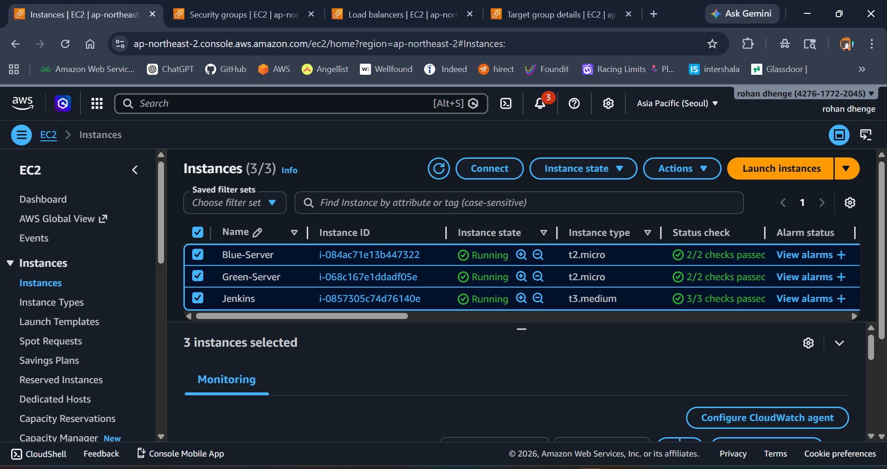

# 🚀 Blue-Green Deployment using Jenkins & AWS

## 📌 Project Overview

This project demonstrates a **Blue-Green Deployment strategy** using **Jenkins CI/CD** and **AWS EC2 + Application Load Balancer (ALB)**.

The goal is to achieve:

* ✅ Zero downtime deployment
* ✅ Safe release strategy
* ✅ Instant rollback capability

---

## 🏗️ Architecture

```
                ┌───────────────┐
                │   Jenkins     │
                └──────┬────────┘
                       │
                       ▼
              ┌──────────────────┐
              │   GitHub Repo    │
              └──────────────────┘
                       │
        ┌──────────────┴──────────────┐
        ▼                             ▼
 ┌──────────────┐              ┌──────────────┐
 │  BLUE Server │              │ GREEN Server │
 │  (Old App)   │              │ (New App)    │
 └──────┬───────┘              └──────┬───────┘
        │                              │
        └──────────┬───────────────────┘
                   ▼
          ┌──────────────────┐
          │   AWS ALB        │
          │ (Traffic Switch) │
          └──────────────────┘
```

---

## ⚙️ Technologies Used

* Jenkins (CI/CD)
* AWS EC2
* AWS ALB (Application Load Balancer)
* GitHub
* Linux (Ubuntu)
* Bash scripting

---

## 📂 Project Structure

```
blue-green-deployment/
│── Jenkinsfile
│── index.html
│── README.md
```

---

## 🚀 Setup Steps 

## Launch EC2 :



### 1️⃣ Install Jenkins

```bash
sudo apt update
sudo apt install openjdk-21-jdk -y

curl -fsSL https://pkg.jenkins.io/debian-stable/jenkins.io.key | sudo tee \
  /usr/share/keyrings/jenkins-keyring.asc > /dev/null

echo deb [signed-by=/usr/share/keyrings/jenkins-keyring.asc] \
  https://pkg.jenkins.io/debian-stable binary/ | sudo tee \
  /etc/apt/sources.list.d/jenkins.list > /dev/null

sudo apt update
sudo apt install jenkins -y
sudo systemctl start jenkins
sudo systemctl enable jenkins
```

---

### 2️⃣ Setup SSH Access (IMPORTANT)

```bash
sudo su - jenkins

ssh-keygen
ssh-copy-id ubuntu@<Blue-Ip>
ssh-copy-id ubuntu@<43.203.224.107>
```

---

### 3️⃣ Install AWS CLI

```bash
sudo apt install awscli -y
aws configure
```

---

### 4️⃣ Clone Repository

```bash
git clone https://github.com/rohandhenge/blue-green-deployment.git
cd blue-green-deployment
```

---

### 5️⃣ Sample Deployment File

```bash
echo "<h1>Version 1 - BLUE Environment</h1>" > index.html
```


---

## ⚙️ Jenkins Pipeline (Jenkinsfile)

```

pipeline {
    agent any

    environment {

        //  CHANGE HERE → Blue Target Group ARN
        BLUE_TG  = 'arn:aws:elasticloadbalancing:ap-northeast-2:427617722045:targetgroup/TG-Blue/51d1c11587f20f1f'

        //  CHANGE HERE → Green Target Group ARN
        GREEN_TG = 'arn:aws:elasticloadbalancing:ap-northeast-2:427617722045:targetgroup/TG-Green/e3c645fea483d2e3'

        //  CHANGE HERE → ALB Listener ARN
        LISTENER_ARN = 'arn:aws:elasticloadbalancing:ap-northeast-2:427617722045:listener/app/blue-green-alb/77968cc89beecbee/70ea8976420306be'

        //  CHANGE HERE → Green server public IP
        GREEN_IP = '43.203.224.107'
    }

    stages {

        stage('Deploy to Green') {
            steps {
                sh """
                echo "Deploying to GREEN server..."

                # Copy file to server
                scp -o StrictHostKeyChecking=no index.html ubuntu@${GREEN_IP}:/tmp/

                # Move file to nginx directory
                ssh -o StrictHostKeyChecking=no ubuntu@${GREEN_IP} sudo mv /tmp/index.html /var/www/html/index.html
                """
            }
        }

        stage('Health Check') {
            steps {
                script {
                    echo "Checking application health..."

                    sleep 15

                    def status = sh(
                        script: "curl -s -o /dev/null -w '%{http_code}' http://${GREEN_IP}",
                        returnStdout: true
                    ).trim()

                    echo "HTTP Status: ${status}"

                    if (status != "200") {
                        error("❌ Health check failed")
                    } else {
                        echo "✅ Health check passed"
                    }
                }
            }
        }

        stage('Switch Traffic') {
            steps {
                sh """
                echo "Switching traffic to GREEN..."

                aws elbv2 modify-listener \
                --listener-arn ${LISTENER_ARN} \
                --default-actions Type=forward,TargetGroupArn=${GREEN_TG}
                """
            }
        }
    }

    post {
        failure {
            echo "❌ Deployment failed — rolling back to BLUE..."

            sh """
            aws elbv2 modify-listener \
            --listener-arn ${LISTENER_ARN} \
            --default-actions Type=forward,TargetGroupArn=${BLUE_TG}
            """
        }
    }
}
```

---

## 🔁 Deployment Flow

1. Jenkins pulls latest code from GitHub
2. Deploys application to **GREEN server**
3. Performs **health check**
4. If success → switches traffic via ALB
5. If failure → rollback to **BLUE server**

---

## 📸 Deliverables

### ✅ 1. Jenkins Pipeline Screenshot

* Shows all stages (Deploy, Health Check, Switch Traffic)


---

### ✅ 2. Target Group Switching Screenshot

* AWS Console → EC2 → Target Groups
* Show traffic switching from BLUE → GREEN


---

### ✅ 3. Deployment Demo

* BLUE Version:

  ```
  http://<ALB_DNS>
  ```


* GREEN Version (after switch):

  ```
  http://<ALB_DNS>
  ```


---

### ✅ 4. Application UI Output

Example Output:

```
🚀 Deployment Version 2
BLUE environment → Old version
GREEN server → Tested successfully
✅ GREEN environment is LIVE
```


---

## 🧠 Key Features

* Zero Downtime Deployment
* Automated CI/CD using Jenkins
* Traffic Switching using AWS ALB
* Rollback Mechanism
* Health Check Validation

---

## 👨‍💻 Author

**Rohan Dhenge**
Cloud & DevOps Engineer

---
